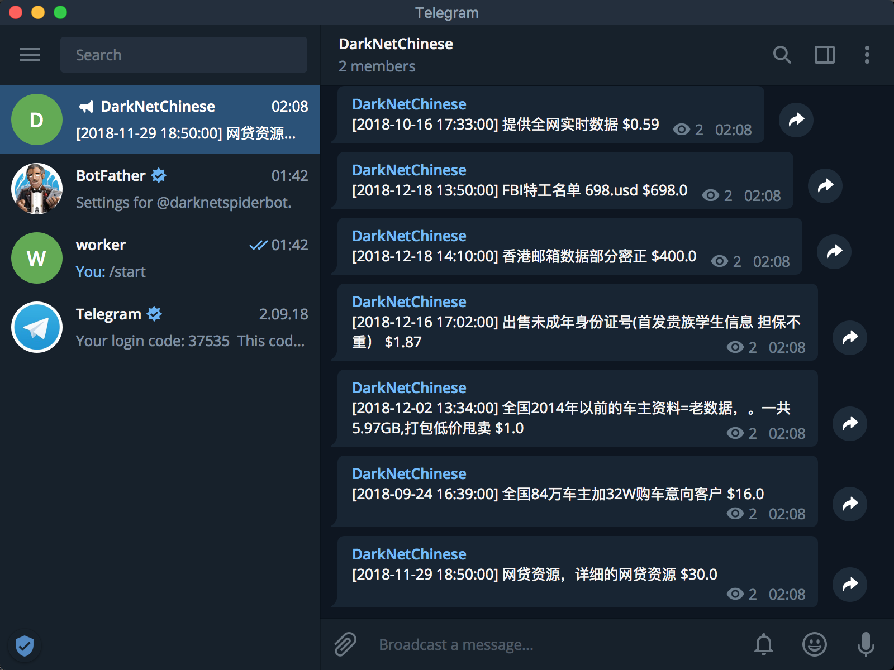

## DarkNet_ChineseTrading - 暗网中文网监控实时爬虫


## 监控大屏(grafana快速实现)


## 功能

- 自动注册
- 自动登录
- 防封禁
- ORM交互
- 事件详情/样本信息录入
- 事件提醒（telegram）

## 安装(Mac下)

- ### python环境配置

	下载并安装 **anaconda 3.5**

	```
	pip install -r ./requirements.txt
	```
	
- ### tor安装
	
	```
	brew install tor
	
	cd /usr/local/etc/tor
	cp torrc.sample ./torrc
	vi torrc
	```
	将如下配置添加到 ** ```torrc``` ** 后，运行 ** ```restart_tor.sh``` ** 开启tor
	
	```
	SOCKSPort 9150 					# socks5代理地址
	Socks5Proxy 127.0.0.1:1086 		# 科学上网代理地址(如已翻墙可不填)
	RunAsDaemon 1 					# 开启后台运行
	ControlPort 9151 				# 开启控制端口
	
	```
	
- ### 存储环境

	安装**```Docker```**后下载**```Redis```** **```Mysql```** 即可

- ### 运行
	配置```config_dev.py```中的连接设定与```TelegramRobotToken```

	```
	mv config_dev.py config.py
	bash restart_tor.sh
	bash restart_celery.sh
	python run.py
	```
	
- ### 运行逻辑
	
	
	
- ### 运行结果截图

	- #### telegram
		
		
		
	- #### ```run.py```
	
		
	
	
	
	
	
	


