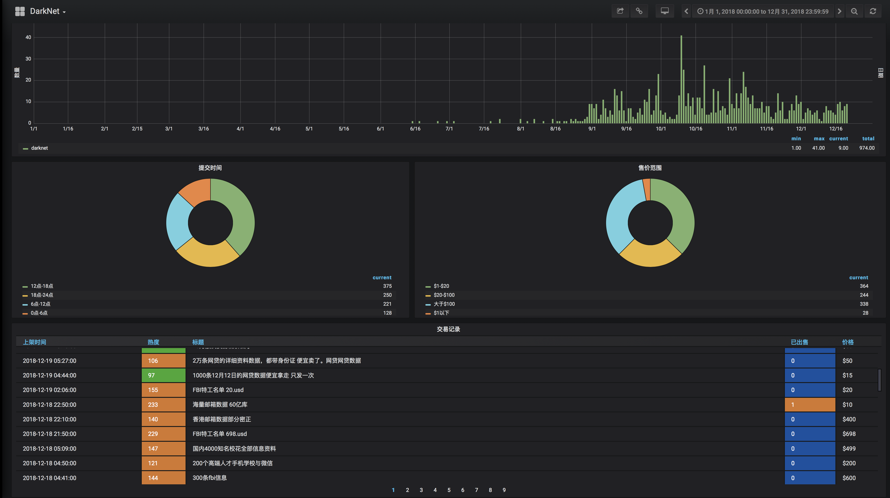
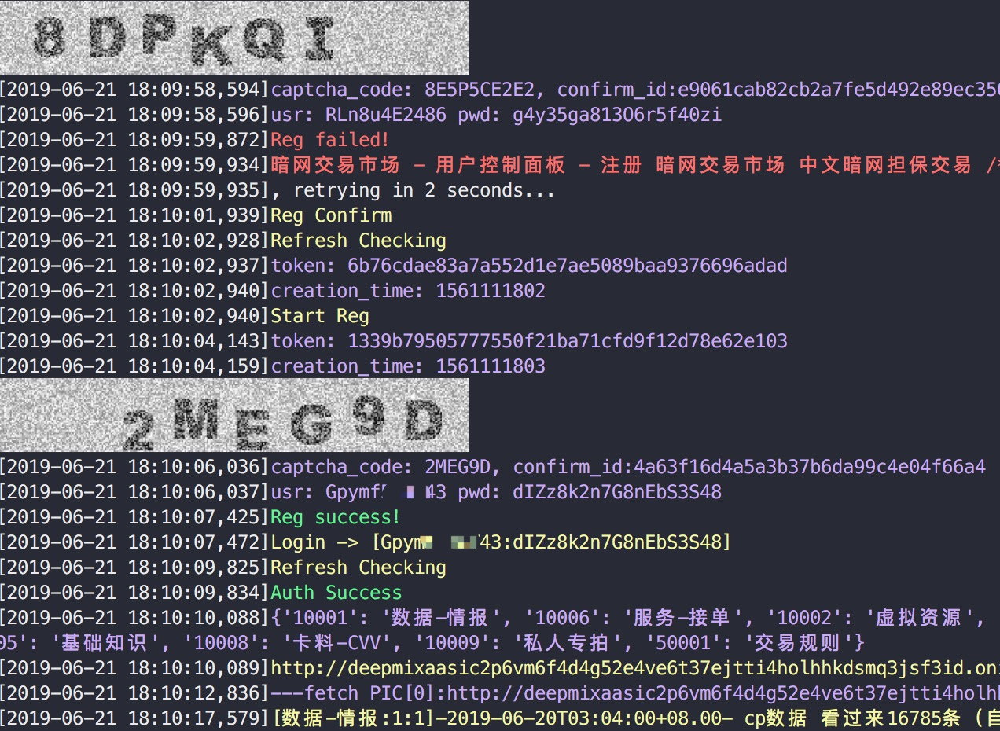
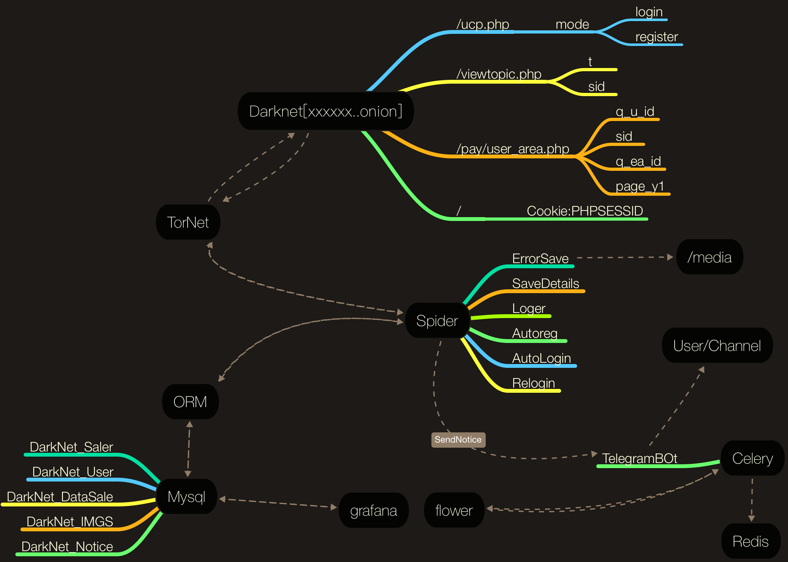
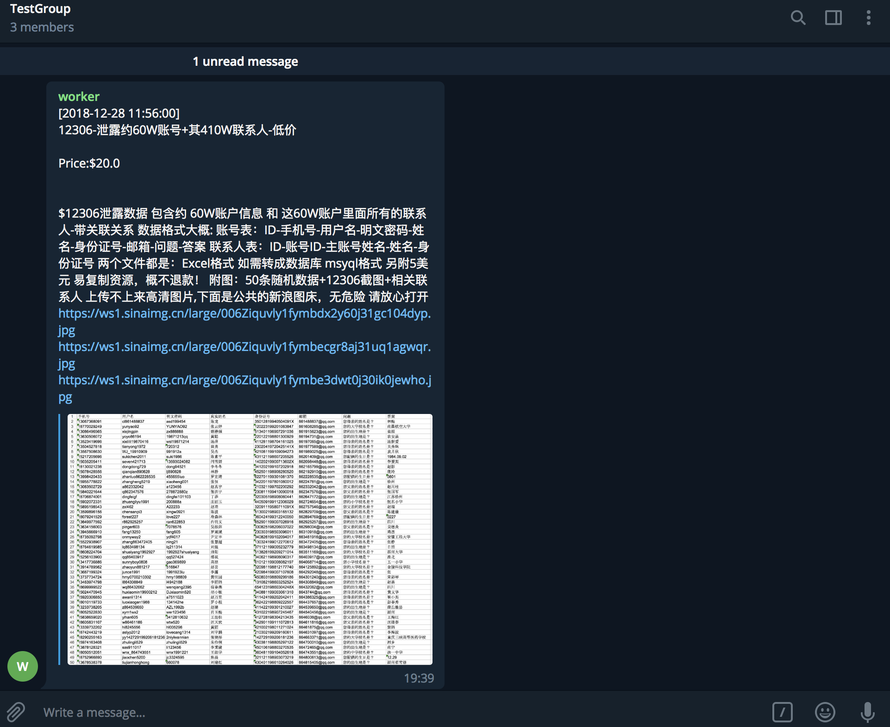
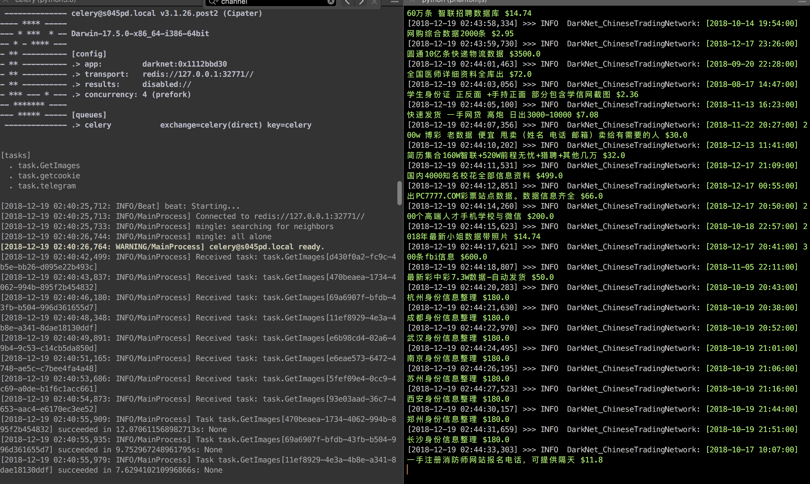

## DarkNet_ChineseTrading - A crawler for real-time monitoring of the dark network website.


## Monitor screen(by grafana)



## Features

- Automatic Tor node switch
- Automatic registration
- Automatic Log-in
- Anti-ban
- ORM
- Event details
- Event reminder（telegram）[Graphic with Photo]

join us：[https://t.me/fordarknetspiderbot](https://t.me/fordarknetspiderbot)

## Install(Mac)

- ### python env config

	download and install the integrated environment , **anaconda 3.5** ,and then install the required pkg

	```
	pip install -r ./requirements.txt
	pip install -U 'requests[socks]'
	```
	
- ### install tor 
	
	```
	brew install tor
	
	cd /usr/local/etc/tor
	cp torrc.sample ./torrc
	vi torrc
	```
	Add the following to configure **```torrc```** and run the command **```restart_tor.sh```** to restart the tor
	
	```
	SOCKSPort 9150 					# socks5 proxy address
	Socks5Proxy 127.0.0.1:1086 		# shadowsocks proxy(if you are in China)
	RunAsDaemon 1 					# running in the background
	ControlPort 9151 				# open control port
	
	```
	
- ### Storage

	install **```Docker```** with **```Redis```** **```Mysql```**

- ### Run
	configure the connection in ```config_dev.py```and```TelegramRobotToken```

	```
	mv config_dev.py config.py
	bash restart_task.sh
	python run.py
	```

- ### OCR(mac)

	

	```
	brew install tesseract
	```
	
- ### Running logic
	
	
	
- ### Result screenshot

	- #### telegram
		
		
		
	- #### ```run.py```
	
		
	
	
	
	
	
	


